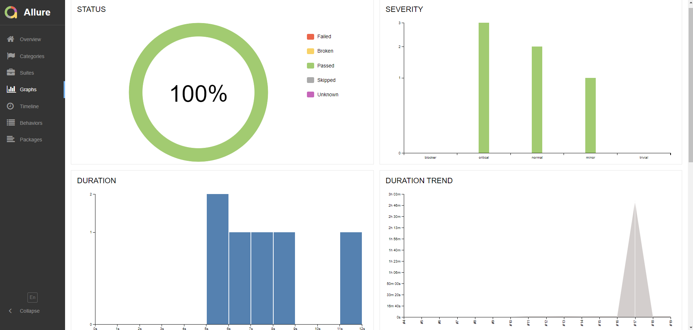

# Проект по автоматизации тестирования онлайн-сервиса путешествий [Tutu.ru](https://www.tutu.ru)

## Содержание

- [Технологии и инструменты](#octocat-технологии-и-инструменты)
- [Список реализованных проверок в автотестах](#white_check_mark-список-реализованных-проверок-в-автотестах)
- [Запуск тестов в Jenkins с параметрами](#rocketl-Запуск-тестов-в-Jenkins-с-параметрами)
- [Отчет о результатах тестрования в Allure-reports](#bookmark_tabs-Отчет-о-результатах-тестрования-в-Allure-reports)
- [Уведомление в Telegram о результатах проверки с использованием бота](#loudspeaker-Уведомление-в-Telegram-о-результатах-проверки-с-использованием-бота)
- [Видео-отчет прохождения теста на Selenoid](#movie_camera-Видео-отчет-прохождения-теста-на-Selenoid)

#### [Сайт онлайн-сервиса Tutu](https://www.tutu.ru)

## Цель проекта

Тестирование основных функций онлайн-сервиса, позволяющих пользователям пройти успешную авторизацию, заполнить персональные данные в личном кабинете, успешно найти необходимую информацию по наличию и стоимости билетов.

## :octocat: Технологии и инструменты

## :white_check_mark: Список реализованных проверок в автотестах

- Проверка успешной авторизации пользователя
- Проверка отсутствия авторизации при вводе неверного пароля
- Редактирование данных профиля пользователя
- Изменение изыка сайта
- Поиск авиабилетов

## :rocket: Запуск тестов в Jenkins с параметрами

## :bookmark_tabs: Отчет о результатах тестрования в Allure-reports

## :loudspeaker: Уведомление в Telegram о результатах проверки с использованием бота

## :movie_camera: Видео прохождения тестов на Selenoid

<code>Selenoid</code> пишет видео прогона каждого теста и видео прикладывается в отчет <code>Allure</code>

